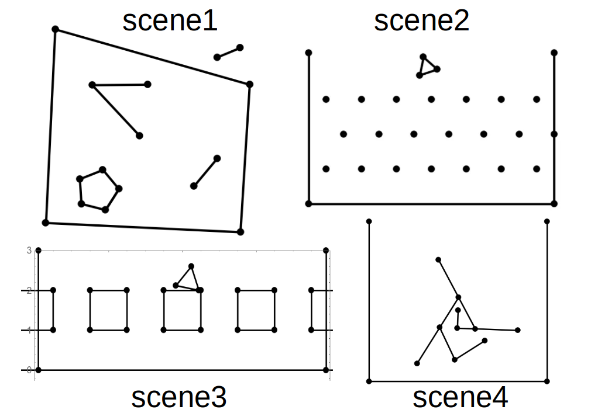
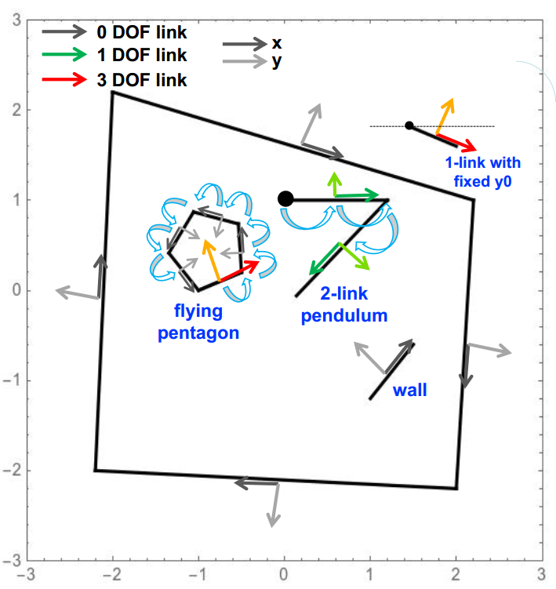

# API for Simulating Multi-link System
Final project of ME314 Machine Dynamics

student: Feiyu Chen

video domos:
[scene1](http://feiyuchen.com/wp-content/uploads/scene1_10s_slowed.mp4), 
[scene2](http://feiyuchen.com/wp-content/uploads/scene2_10s_slowed.mp4), 
[scene3](http://feiyuchen.com/wp-content/uploads/scene3_15s_slowed.mp4), 
[scene4](http://feiyuchen.com/wp-content/uploads/scene4_10s.mp4)

# Contents:
-   [1. Introduction](#1.-Introduction)
-   [2. Files](#2.-Files)
-   [3. API Functions](#3.-API-Functions)
-   [4. Example of Using My Functions](#4.-Example-of-Using-My-Functions)
-   [5. Calculation of EL-eqs and Impacts](#5.-Calculation-of-EL-eqs-and-Impacts)
-   [6. How is This API being
    Generalized](#6.-How-is-This-Api-Being-Generalized)
-   [7. Problems](#7.-Problems)


# 1. Introduction

## 1.1 Why I made this API
It can be a big headache to hardcode the simulation of multi-link system in Mathematica, as it's trivial to type in all formulas and to deal with all kinds of weird bugs. The goal of this project is to reduce such pain by wrapping up an API (> Application Programming Interface) so users/students could build up a simulation by using simple functions.

## 1.2 Intro

The core of the API is a set of functions called "createLink", with Applications of creating links, triangle (polygon), vertices and wall. I made 4 scenes to demonstrate the usage of my API which are stored in "./scenes/". The videos are in current folder. The images are shown here.

  

Figure 1. Four example scenes of multi-link system.


## 1.3 How to run

Open this [run_this.nb](run_this.nb). Modify code and choose a scene in the second cell (you can search the keyword "Choose a scene"). And then run through the whole script.  
The scenes .nb files are in "./scenes/".

# 2. Files
## 2.1 run_this.nb
This is the main file.

## 2.2 scenes/  
The scenes are stored in "./scenes/". Inside each scene script, there is a only function called "CreateObjects[]". Inside it, the codes describe the links that form the simulation. You may change it and create your own.

## 2.3 lib/
This stores 3 library files: [funcs_assist.nb](funcs_assist.nb), [funcs_main.nb](funcs_main.nb), and [funcs_math.nb](funcs_math.nb). They provide the necessary functions and parameters for the main script. They will be loaded when running the "run_this.nb".

# 3. API Functions
I wrote 5 functions:

### 3.1 createVertex  

  Create a vertex.   

  > Application: create a point obstacle, or append a link to it to make a pendulum.

### 3.2 createLink0DOFpp  

  Create a link with 0 degrees of freedom (DOF). The "pp" at the end indicates that the inputs are two points  "point1" and "point2" with format of 2-vector.  

  > Application: create a wall, or append it to another link to form a rigid body. See an example in Example 1 of creating polygon.

### 3.3 createLink0DOFg$\mathbf{\theta}$l  
  
  This is same as above for creating a 0 DOF link, except that the inputs are:  
      * The starting coordinate's 4x4 matrix $\mathbf{g}$.   
      * Relative angle $\theta$.   
      * Length of this link $\mathbf{l}$.   

### 3.4 createLink1DOFg$\mathbf{\theta}$l  
    
  Create a 1 DOF link. The link can rotate around its starting coordinate $\mathbf{g}$.  

  The inputs "g$\mathbf{\theta}$l" are the same as above, which are used for specifying the starting coordinate, relative angle, and length of this link.  

  > Application: append this link to a pendulum. For example, turning a double-pendulum into a triple-pendulum.

### 3.5 createLink3DOFpp   
   
   Create a 3 DOF link that can move in $\mathbf{x}$ and $\mathbf{y}$ direction and rotate around its center for angle $\theta$.  
   Its inputs are the initial positions of its two vertices.

   > Application: creating a free link. Append other 1 DOF links to it to form a flying multi-link.

# 4. Example of Using My Functions

I will take the scene1 as example and show how to use my API.

Below is a figure of scene1 with annotations of its frames and transformations.



Figure 2. Scene1 with annoations of frames and transformations


The x and y axis of each frame are denoted by straight arrows. There are 3 types of frames/links:    
* <span style="color:red"> *Red frame* </span> is for 3-DOF link that has variables $\mathbf{x}$, $\mathbf{y}$, and $\mathbf{theta}$.    
* <span style="color:green"> *Green frame* </span> is for 1-DOF link, which has variable $\mathbf{theta}$ and can rotate around a certain pivot.    
* <span style="color:gray"> *Gray frame* </span> is for 0-DOF link, whose two vertices are fixed in a certain frame.  

The transformations between different frames are denoted by curved arrows in <span style="color:cyan"> **cyan**</span>. These transformations connect up several links to form an object. 

There are 5 groups of links in the figure:   
1. A pentagon (DOF=3)  
2. A 2-link pendulum (DOF=2)  
3. A 1-link pendulum (DOF=3, height of the left vertex is fixed)  
4. A 1-link wall (DOF=0)  
5. Four walls around the main objects (DOF=0)  

The pseudo code for creating these 5 groups of links are as follows:

* 1 . Pentagon (3 DOF)
  > createLink3DOF   
createLink0DOF  
createLink0DOF  
createLink0DOF  
createLink0DOF  

* 2 . Two-link pendulum (2 DOF)
  > createVertex  
createLink1DOF  
createLink1DOF  

* 3 . One-link with constrained height (3 DOF + 1 Constraint)  
  > createLink3DOF   
addConstraint[y==0]  

* 4/5 . Walls (0 DOF)  
  > createLink0DOF   
createLink0DOF  

After creating these links, you can simply run the main file and see the animation.

## 5. Calculation of EL-eqs and Impacts

### 5.1 Kinetic and Potential Energy 
Suppose a link has length $\mathbf{l}$. Then I assume its mass to be $\mathbf{l}$ and inertia to be $\mathbf{l^2}$. The generalized 6x6 body mass M is then obtained.  

For each link, I compute the 4x4 matrix representation $\mathbf{g}$ of its center frame. Then calculate the body screw velocity $\mathbf{V}$ using $\mathbf{g}$ and $\mathbf{dg/dt}$. Then the kinetic energy is $\frac{1}{2}\mathbf{V^T M V}$.  

### 5.2 Constraint and External Force  

These two elements can be easily added up to the EL-eqs.  

In scene1.nb, I add a constraint to the link at right up corner. I fixed its height by the code below, where "IdxPBack" refers to the "Point at Back side", and "[[2]]" refers to "y" ("[[1]]" refers to "x"). One internal problem of constraint is that its only added to the velocity, not displacement. See the Section "Problems" for more details. 
> addConstraint[linki[[IdxPBack]][[2]] == 0];

The external forces are set in this sentence:
> externalForces = ConstantArray[0, nVars];

### 5.3 Detecting Impacts

The impact happens when **one link's vertex** goes through **another link's edge**. The two links should also from different groups.

The impact conditions are defined in the function **"SetUpImpactEvents"** in **"lib/funcs_main.nb"**.

For determining whether a vertex is inside the edge, I wrote two different methods/functions. In the current version, the second function is adopted:

1. checkInObstacle1: checks the distance between vertex and edge. If the distance is small, then vertex is in edge.
2. checkInObstacle2: checks the sign of distance between vertex and edge. A change of sign means the vertex goes through the edge.

(Meanwhile, whether the projection of vertex is on edge is also considered.)

### 5.4 Impact Update  

The logic of my code for impact detection  looks like this:  

```
Loop{
   While(no impact && t!=t_end{
       NDSolve
   }
   if(impacts){
       impact update for each impact
   }else{
       break
   }
}
```

  
# 6. How is This API being Generalized

* How to deal with the varying total DOF  
   I push variables into a list, and use vector/matrix operation to compute all equations. It requires some understanding of all the formulas.

* How to detect impact  
   Every time adding a new link, I push its **edge** into a list, and push its 2 **vertices** into another list. When detecting impacts, I go through these two lists, and check if a **vertex** is near an **edge**. (The vertex and edge that have a same group ID will be ignored.)


# 7. Problems
### **Not Detecting Some Impacts**
  At some occasions, the vertex might go through the edge. The cause is that the object's velocity is too large, or the integration step length is too large. Currently, I didn't implement any advanced techinques to go back and forth to check the exact impact time. 
  
  So you might need to reduce the integration step length, or make your scene smaller (thus less potential energy and a smaller max speed).

### **Slow Computing**   
   When the total DOF<10, links<15, step_size=0.001, simulation_time=15s, it takes about 3 minutes to compute all motions. Thus, the DOF and links cannot be too many, or it will cost too much time to compute impacts and do NDSolve.

### **Be Cautions with Constraint**
  When applying constraint to a configuration variable, we must make sure that this variable won't move perpendicular to the constraint surface. Two cases (which are not subject to the solution of EL-eqs) can cause problem of making total energy not conserved:  

  1. Wrong initial velocity.
  2. Impacts. 
  
  The reason is that we are  actually not applying constraint $\mathbf{\phi}$. Instead, we use $\mathbf{d\phi /dq}$ and $\mathbf{d^2\phi /dt^2}$ for solving EL-eqs.

### **No Varying Constraint**  
  I didn't add varying constraint in this project. But I do make an analysis of how to do it below:  

  Consider a chair on the floor. Under my current scheme, the chair will keep on impacting with the floor and make the simulation slow and inaccurate.  
  
  What I'm supposed to add: If the speed of the contact point after impact is very small, I should add a constraint to it to make this point fix on the floor. Then, do the Solve again, and keep on NDSolve. Then, if at some time the constraint force is zero or changes direction, I should remove this constraint.