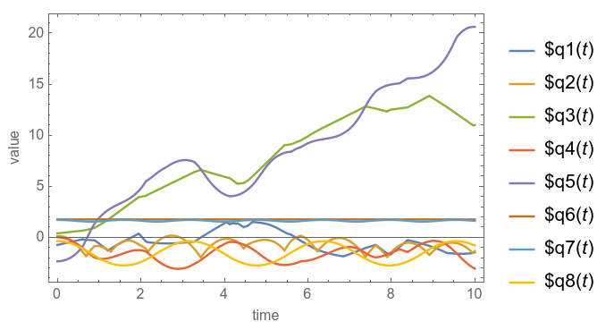
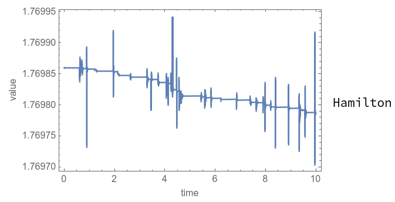

# ME314 Final Project
# Encapsulation of Functions for Simulating Multi-link System
## Feiyu Chen

# 1. Introduction

It can be a big headache to hard code the simulation of multi-link system in Mathematica, as it's trivial to type in all formulas and to deal with all kinds of weired bugs. The goal of this project is to reduce such pain by wrapping up an API (Application Programming Interface) so users could achieve the simulation by using simple functions. (Another goal is to make this a cool final project.)

The core of the API is a set of functions called "createLink", with applications of creating links, triangle (polygon), and wall. A screen shot of my project's video demo is shown here:

To view the full demo, please see "video.mp4".

# 2. How to run
The main script is this: [run_this.nb](run_this.nb).  
You can run it in Mathematica to see the final animation. It takes about 1 minute to compute the 10-second motion of all links. (The initial velocity of links are random, so it might be different from the video I recorded.)

The settings of each link are put inside a function called "CreateObjects[]". You can make changes to it to create other simulated multi-link systems.

The other 3 files, [funcs_assist.nb](funcs_assist.nb), [funcs_main.nb](funcs_main.nb), and [funcs_math.nb](funcs_math.nb), provie the necessary functions and parameters for the main script.

# 3. API Functions
I wrote 5 functions:
1. createVertex  
    Create a vertex.  
    > Appliaction: create a point obstacle, or append a link to it to make a pendulum.

2. createLink0DOFpp  
    Create a link with 0 degrees of freedom (DOF). The "pp" at the end indicates that the inputs are two points  "point1" and "point2" with format of 2-vector.  
    > Appliaction: create a wall, or append it to another link to form a rigid body. See an example in Example 1 of creating polygon.

3. createLink0DOFg$\theta$l  
    This is same as above for creating a 0 DOF link, except that the inputs are: 
    * The starting coordinate's 4x4 matrix $g$.
    * Relative angle $\theta$.
    * length of this link $l$.
  
4. createLink1DOFg$\theta$l  
    Create a 1 DOF link. The link can rotate around its starting coordinate $g$.   
    The inputs "g$\theta$l" are same as above, which are used for specifying the starting coordinate, relative angle, and length of this link.   
    > Appliaction: append this link to a pendulum. For example, turning a double-pendulum into a triple-pendulum.

5. createLink3DOFpp  
    Create a 3 DOF link that can move in $x$ and $y$ direction and rotate around its center for angle $\theta$.  
    The inputs are the initial positions of its two vertices.
    > Appliaction: creating a free link. Append other 1 DOF links to it to form a flying multi-link.

# 4.Examples
I put some pseudo code here to provide a rough idea of how to use these functions.

## 4.1 Pentagon (3 DOF)
> createLink3DOF  
createLink0DOF  
createLink0DOF  
createLink0DOF  
createLink0DOF  

## 4.2 Two-link pendulum (2 DOF)
> createVertex  
createLink1DOF  
createLink1DOF  

## 4.3 One-link with constrained height (3 DOF + 1 Constraint)
> createLink3DOF  
addConstraint[y==0]

## 4.4 Walls (0 DOF)
> createLink0DOF  
createLink0DOF

After creating these links, you can simply run the code and see the animation.

# 5. Technical details
* How to detect impact  
    Every time adding a new link, I push its **edge** into a list, and push its 2 **vertices** into another list. When detecting impacts, I go through these two lists, and check if a **vertex** is near an **edge**. (The vertex and edge that have a same group ID will be ignored.)

* How to deal with the varying total DOF  
    I push varibles into a list, and use vector/matrix operation to compute all equations.
    
# 6 Problems
* The total DOF had better <10, and not too many links. Otherwise it will cost too much time to compute impacts and do NDSolve.
* Fail to detect some impacts:
    
    Guess 1:
    I tried to use NDSolve's EventLocator's multi-event function, but failed (I couldn't put a list varible there). So I manually code it to detect multiple impacts. Its problem is, if I detect an impact at time i, I need to silence it in time i+1, and then it can detect impacts later. Thus, the only case of not detecting impact that I can image is the vertex go through the edge in 2 simulation cycle. (If using EventLocator's multi-event, the special case would be 1 simulation cycle.)

    Guess 2: I believe there are problems that cause this bug. But I don't know what they are.

    Solution 1: May be I can solve the problem by detecting the change of sign of the distance to know if a vertex goes through the edge. But its impact criteria would be a little bit more complex than before, and I'm still worrying about the edge cases. I'll try it next time.

* Constraint: When applying constraint to a configuration variable, we must make sure that this variable won't move perpendicular to the constraint surface. Two cases (which are not subject to the solution of EL-eqs) can cause problem of making total energy not conserved:  
    1. Wrong initial velocity.
    2. Impacts.  
    
    The reason is that we are  actually not applying constraint $\phi$. Instead, we use $d\phi /dq$ and $d^2\phi /dt^2$ for solving EL-eqs.

# 7. Result
The video is here "video.mp4".

The plot of all variables:

The plot of Hamiltonian:
