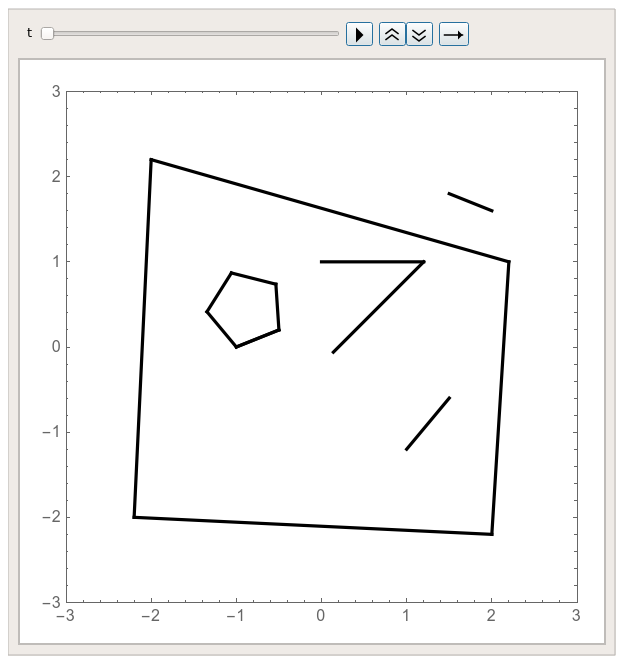

# Report of ME314 Final Project
# Part 2
# Encapsulation of Functions for Simulating Multi-link System
## Feiyu Chen

This is the 2nd Part of my report.  
While the 1st part focuses on describing what system I simulated, this part talks more about my encapsulated "createLink" functions, how they are used, problems, and drawbacks I met.

# 1. Introduction

It can be a big headache to hardcode the simulation of multi-link system in Mathematica, as it's trivial to type in all formulas and to deal with all kinds of weird bugs. The goal of this project is to reduce such pain by wrapping up an API (> Application Programming Interface) so users could achieve the simulation by using simple functions. (Another goal is to make this a cool final project.)

The core of the API is a set of functions called "createLink", with > Applications of creating links, triangle (polygon), and wall. A screenshot of my project's video demo is shown here:  

  

Figure 1. Simulation of multi-link system.

To view the full demo, please see "scene1.mp4".

# 2. How to run

The main script is this: [run_this.nb](run_this.nb). You can run it in Mathematica to see the final animation.

Settings of each link are put inside a function called "CreateObjects[]". You may make changes to create other simulated multi-link systems.

The other 3 files, [funcs_assist.nb](funcs_assist.nb), [funcs_main.nb](funcs_main.nb), and [funcs_math.nb](funcs_math.nb), provide the necessary functions and parameters for the main script.

# 3. API Functions
I wrote 5 functions:

### 3.1 createVertex  

  Create a vertex.   

  > Application: create a point obstacle, or append a link to it to make a pendulum.

### 3.2 createLink0DOFpp  

  Create a link with 0 degrees of freedom (DOF). The "pp" at the end indicates that the inputs are two points  "point1" and "point2" with format of 2-vector.  

  > Application: create a wall, or append it to another link to form a rigid body. See an example in Example 1 of creating polygon.

### 3.3 createLink0DOFg$\mathbf{\theta}$l  
  
  This is same as above for creating a 0 DOF link, except that the inputs are:  
      * The starting coordinate's 4x4 matrix $\mathbf{g}$.   
      * Relative angle $\theta$.   
      * Length of this link $\mathbf{l}$.   

### 3.4 createLink1DOFg$\mathbf{\theta}$l  
    
  Create a 1 DOF link. The link can rotate around its starting coordinate $\mathbf{g}$.  

  The inputs "g$\mathbf{\theta}$l" are the same as above, which are used for specifying the starting coordinate, relative angle, and length of this link.  

  > Application: append this link to a pendulum. For example, turning a double-pendulum into a triple-pendulum.

### 3.5 createLink3DOFpp   
   
   Create a 3 DOF link that can move in $\mathbf{x}$ and $\mathbf{y}$ direction and rotate around its center for angle $\theta$.  
   Its inputs are the initial positions of its two vertices.

   > Application: creating a free link. Append other 1 DOF links to it to form a flying multi-link.

# 4.Examples
I put some pseudo code here to provide a rough idea of how to use these functions.

## 4.1 Pentagon (3 DOF)
> createLink3DOF   
createLink0DOF  
createLink0DOF  
createLink0DOF  
createLink0DOF  

## 4.2 Two-link pendulum (2 DOF)
> createVertex  
createLink1DOF  
createLink1DOF  

## 4.3 One-link with constrained height (3 DOF + 1 Constraint)  
> createLink3DOF   
addConstraint[y==0]  

## 4.4 Walls (0 DOF)  
> createLink0DOF   
createLink0DOF  

After creating these links, you can simply run the code and see the animation.

# 5. Technical details
* How to detect impact  
   Every time adding a new link, I push its **edge** into a list, and push its 2 **vertices** into another list. When detecting impacts, I go through these two lists, and check if a **vertex** is near an **edge**. (The vertex and edge that have a same group ID will be ignored.)

* How to deal with the varying total DOF  
   I push variables into a list, and use vector/matrix operation to compute all equations.
  
# 6 Problems
### **Not Detecting Some Impacts**

  This has been discussed in Report_par1.pdf. Maybe because the vertex goes through the edge in 2 integration steps, causing my program not detecting it. 

### **Slow Computing**   
   When the total DOF<10, links<15, step_size=0.001, simulation_time=15s, it takes about 3 minutes to compute all motions. Thus, the DOF and links cannot be too many, or it will cost too much time to compute impacts and do NDSolve.

### **Be Cautions with Constraint**
  When applying constraint to a configuration variable, we must make sure that this variable won't move perpendicular to the constraint surface. Two cases (which are not subject to the solution of EL-eqs) can cause problem of making total energy not conserved:  

  1. Wrong initial velocity.
  2. Impacts. 
  
  The reason is that we are  actually not applying constraint $\mathbf{\phi}$. Instead, we use $\mathbf{d\phi /dq}$ and $\mathbf{d^2\phi /dt^2}$ for solving EL-eqs.

### **No Varying Constraint**  
  I didn't add varying constraint in this project. But I do make an analysis of how to do it below:  

  Consider a chair on the floor. Under my current scheme, the chair will keep on impacting with the floor and make the simulation slow and inaccurate.  
  
  What I'm supposed to add: If the speed of the contact point after impact is very small, I should add a constraint to it to make this point fix on the floor. Then, do the Solve again, and keep on NDSolve. Then, if at some time the constraint force is zero or changes direction, I should remove this constraint.
